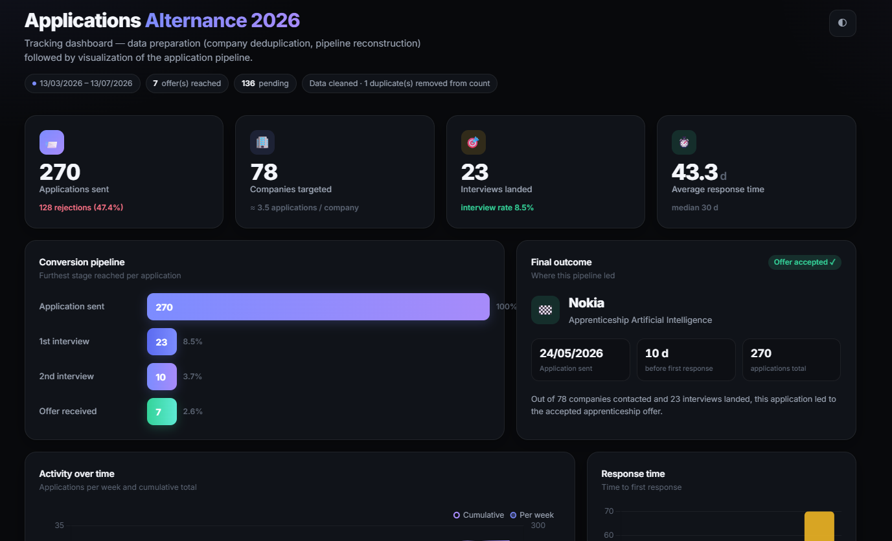

# Alternance 2026 Applications

A dashboard tracking my 2026 apprenticeship search: 270 applications sent to 78 companies, from the first email to the offer I accepted at Nokia.

**[View the live dashboard →](https://applications2026.netlify.app/)**

## What's inside

- **Conversion pipeline** — how many applications made it from sent → interview → offer, at each stage
- **Response time** — how long companies took to get back, on average and at the median
- **Activity over time** — a week-by-week and cumulative view of the search
- **Final outcome** — the path that led to the accepted offer

## Data

Applications were logged manually as they went out, then cleaned up (deduplicated, pipeline reconstructed) before being turned into the charts above.
